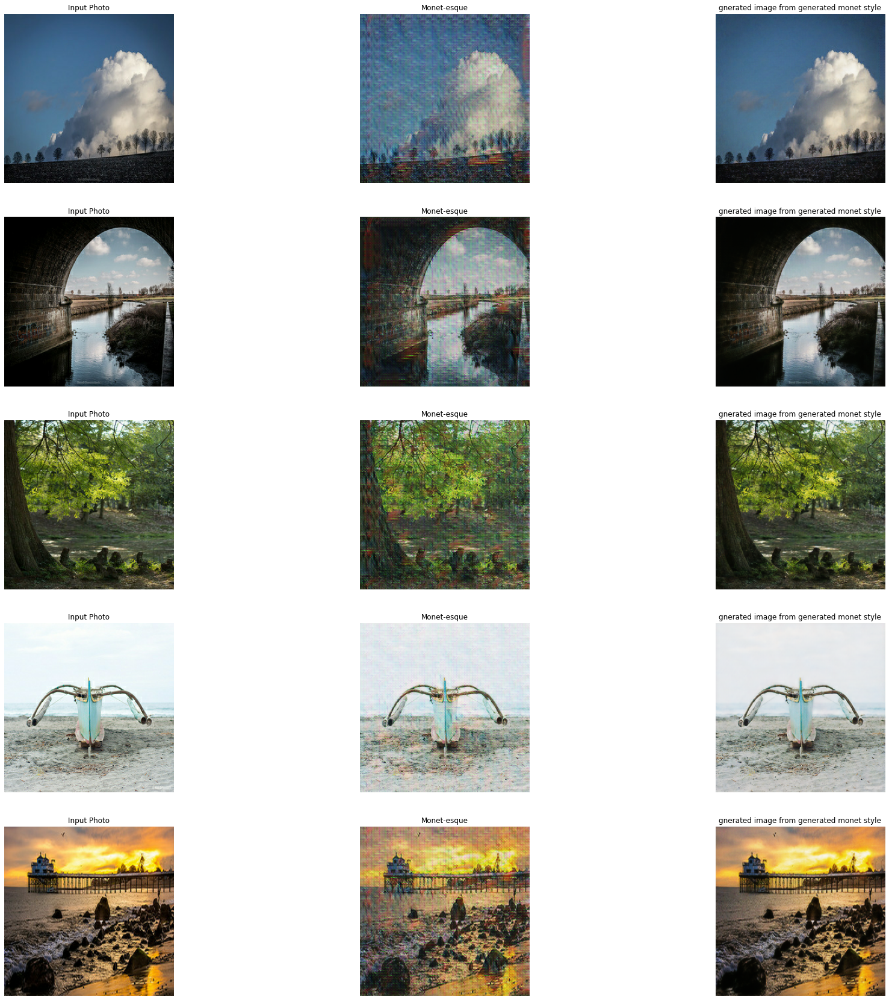
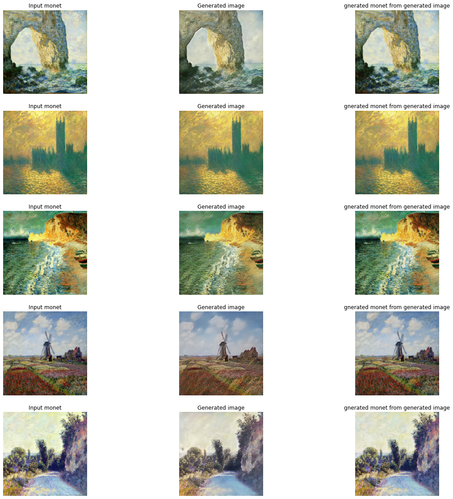

# GAN--Painter
### The models developed in this project can convert a real world photograpgh into a monet style painting. The models can also cn-onvert a monet style painingt into real world photoraph.
### Cycle GAN is trained to achieve the results below. The training is done on K80 GPU
### (the learning from each epoch is stored and is combined  into gif shown below )
### Tools:Tensorflow, Python

#### the model files could not be uploaded here but you can email me at sagarkarki136@gmail.com and I will send you the files. 

